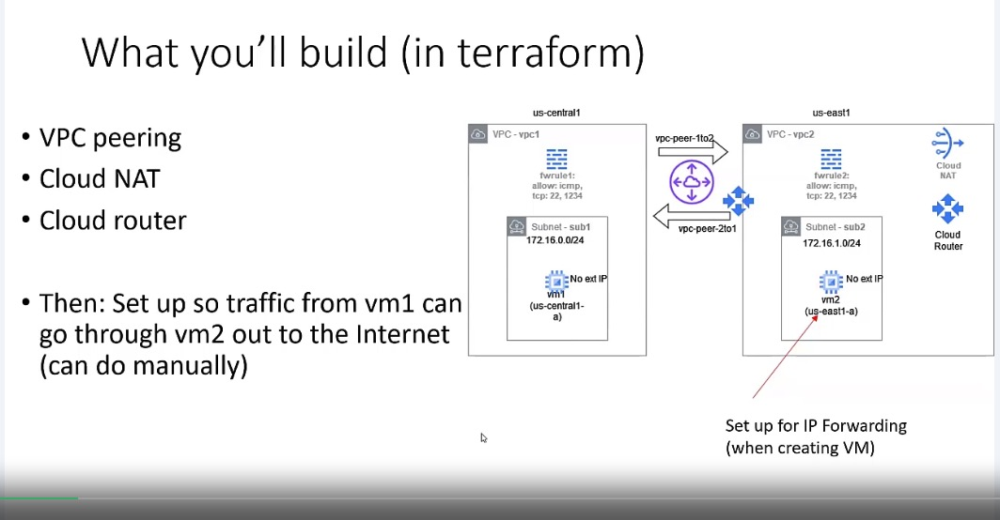
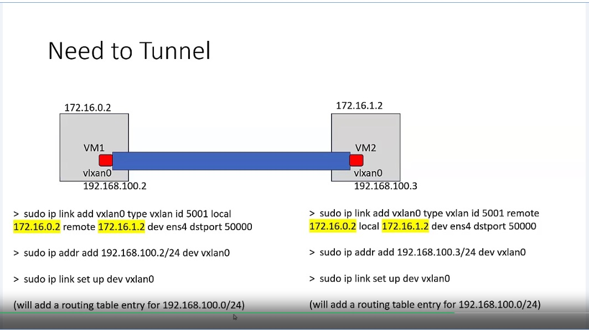
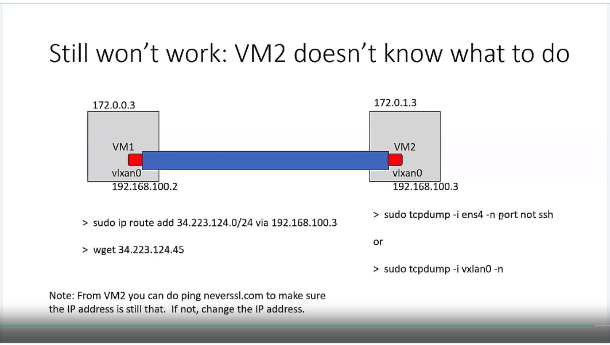
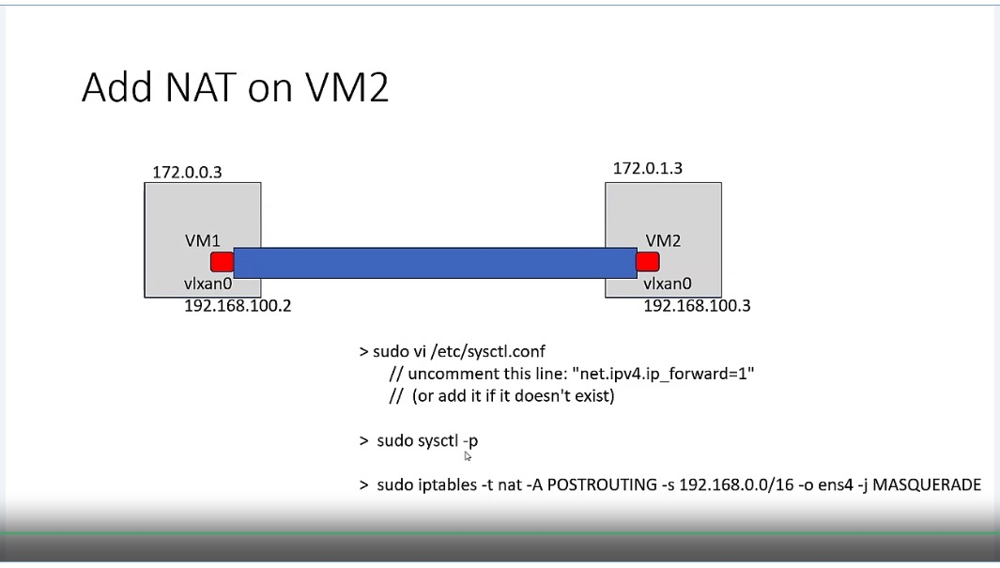

# README
Anthony Lee 2024-11-02

Some update

Module 3 assignment aims to create a two VMs in two different VPCs and configure the networking such that VM1 in VPC1 is able to send traffic to VM2 in VPC2 so that VM2 could deliver the packet to the internet. Both VM1 and VM2 do NOT have public IP thus no direct access to the Internet.

Diagrams:

Steps:
- Use Terraform (TF) to create the VPCs, subnets, and VMs.
- Use TF to configure VPC peering between VPC1 and VPC2.
- Create Cloud Router (RTR) in VPC2.
- Create Cloud NAT (NAT) in RTR (in VPC2).
- Configure tunneling between VM1 and VM2
- Configure routing rule on VM2 so to pass tunnel traffic to the RTR.
- Now this should work.

Evaluation: 
- `terraform output -json` to gather the JSON for running in `jq`.

